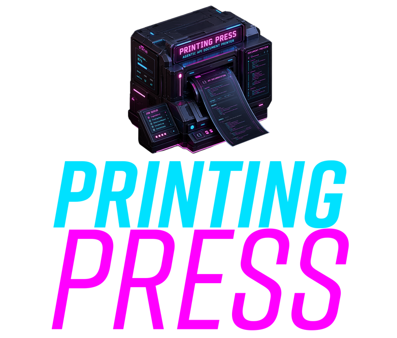

# Printing Press

---
> [!WARNING]
> `printing-press` is currently in preview and is not intended for production use.
---

OpenAPI documentation that is:

- High Quality
- Designed for Agents and Humans
- Beautiful & Clean
- Detailed & Rich
- Fast & Offline
- Instant & Complete

## Install

Install the latest tagged release binary with the shell installer:

```bash
curl -fsSL https://raw.githubusercontent.com/pb33f/printing-press/main/scripts/install_printing_press.sh | sh
```

That installs the `ppress` executable.

Install the npm wrapper package:

```bash
npm i -g @pb33f/printing-press
```

Install with Homebrew:

```bash
brew install pb33f/taps/printing-press
```

Both the npm package and the Homebrew cask install the `ppress` executable.

If you prefer `go install`, Go will still name the binary `printing-press` because it derives command names from the module path:

```bash
go install github.com/pb33f/printing-press@latest
```

For CI environments, set `GITHUB_TOKEN` to avoid GitHub API rate limiting:

```bash
GITHUB_TOKEN="${GITHUB_TOKEN}" curl -fsSL https://raw.githubusercontent.com/pb33f/printing-press/main/scripts/install_printing_press.sh | sh
```

Verify the installed release binary:

```bash
ppress version
ppress version --verbose
```

If you installed via `go install`, use `printing-press version` instead.

## Container image

Each tagged release also publishes a container image to GitHub Container Registry:

```bash
docker run --rm ghcr.io/pb33f/printing-press:latest version
```

To work with local specs and generated docs, bind mount host directories into the container. 
The image already uses `ppress` as its entrypoint and `/work` as its default working directory, so mounted files behave like local CLI inputs.

Render docs from your current directory:

```bash
docker run --rm -v "$PWD:/work" -w /work ghcr.io/pb33f/printing-press:latest ./openapi.yaml
```

If you want to keep the input tree read-only and write docs to a separate host directory:

```bash
mkdir -p ./api-docs
docker run --rm \
  --mount type=bind,src="$PWD",target=/src,readonly \
  --mount type=bind,src="$PWD/api-docs",target=/out \
  -w /src \
  ghcr.io/pb33f/printing-press:latest \
  --output /out ./openapi.yaml
```

On Linux, add `--user "$(id -u):$(id -g)"` for bind-mounted runs so the container can read and write host files as your current user instead of hitting permission problems or leaving root-owned output behind:

```bash
docker run --rm \
  --user "$(id -u):$(id -g)" \
  --mount type=bind,src="$PWD",target=/work \
  -w /work \
  ghcr.io/pb33f/printing-press:latest \
  ./openapi.yaml
```

To serve docs from the container and view them in your browser, publish the container port to the host:

```bash
docker run --rm \
  -p 9090:9090 \
  --mount type=bind,src="$PWD",target=/work \
  -w /work \
  ghcr.io/pb33f/printing-press:latest \
  --serve --port 9090 ./openapi.yaml
```

Then open `http://127.0.0.1:9090`.

If you want a different host port, change the left side of `-p`. For example, `-p 8080:9090` still runs `ppress` on port `9090` inside the container, but you would visit `http://127.0.0.1:8080` on the host.

Tagged images are also published with the release version, for example `ghcr.io/pb33f/printing-press:<release-version>`.

## Quick start

Run a single spec:

```bash
ppress ./openapi.yaml
```

Scan a repo tree and build an API catalog:

```bash
ppress ./services
```

By default the output is written to `./api-docs` in your current working directory.

## Build from source

```bash
go build -o ppress .
./ppress ./openapi.yaml
```

## Usage

```bash
ppress [flags] <spec-path-or-url>
ppress [flags] <directory>
```

Examples:

```bash
ppress ./openapi.yaml
ppress --publish --output ./api-docs ./openapi.yaml
ppress --serve --output ./api-docs ./openapi.yaml
ppress --debug ./openapi.yaml
ppress --theme roger ./openapi.yaml
ppress --vacuum-report ./vacuum-report.json.gz ./openapi.yaml
vacuum report --stdout ./openapi.yaml | ppress --stdin ./openapi.yaml
ppress ./services
ppress --serve ./services
ppress --build-mode fast ./services
ppress --disable-skipped-rendering ./services
```

## Single spec vs API catalog

### Single spec

If the input is a file or URL, `printing-press` renders one documentation site.

Example:

```bash
ppress ./openapi.yaml
```

Typical outputs:

- `index.html`
- `operations/*.html`
- `models/**/*.html`
- `bundle.json`
- `llms.txt`
- `AGENTS.md`

### API catalog

If the input is a directory, `printing-press` scans the tree, discovers root OpenAPI documents, groups them into services and versions, and renders one catalog plus one full doc site per discovered spec entry.

Example monorepo:

```text
services/
  banking/specs/banking.yaml
  auditing/src/things/specs/auditing.yaml
  users/src/specs/usersv1.yaml
  users/src/specs/usersv2.yaml
```

Run:

```bash
ppress ./services
```

That produces:

- a root catalog at `api-docs/index.html`
- grouped service/version docs under `api-docs/services/...`
- per-entry spec docs under `api-docs/services/<service>/versions/<version>/specs/<entry>/...`

## API catalog LLM outputs

Catalog builds also emit an LLM discovery tree so an agent can start at the top and drill down into the exact spec it wants:

- `api-docs/AGENTS.md`
- `api-docs/llms.txt`
- `api-docs/services/<service>/llms.txt`
- `api-docs/services/<service>/versions/<version>/llms.txt`
- `api-docs/services/<service>/versions/<version>/specs/<entry>/AGENTS.md`
- `api-docs/services/<service>/versions/<version>/specs/<entry>/llms.txt`

The intent is:

- root `AGENTS.md` explains the catalog and links to all visible services, versions, and spec-entry indexes
- root `llms.txt` is the compact catalog index
- service and version `llms.txt` files progressively narrow the search space
- each spec entry still carries its own full `AGENTS.md` and `llms.txt`

## Build modes

- default: portable/offline HTML suitable for `file://` use
- `--publish`: hosted/served HTML asset layout for static hosting, but does not start a server
- `--serve`: hosted/served HTML asset layout and starts a local preview server

For GitHub Pages, S3, Netlify, Cloudflare Pages, or similar static hosting, use `--publish`.

## Outputs

By default, `printing-press` renders:

- HTML documentation
- JSON artifacts
- LLM output

You can disable any of these with:

- `--no-html`
- `--no-json`
- `--no-llm`

## vacuum report diagnostics

For single-spec builds, `ppress` can import a vacuum sealed report and render the lint results into the generated docs as developer diagnostics. The report should come from the same OpenAPI document that you pass to `ppress`.

Generate a report file with vacuum, then pass it with `--vacuum-report`:

```bash
vacuum report --compress ./openapi.yaml api-lint
ppress --vacuum-report ./api-lint-<timestamp>.json.gz ./openapi.yaml
```

You can also stream the report directly from vacuum into `ppress`. In this mode, `--stdin` reads the vacuum report from standard input; the OpenAPI spec is still the positional argument:

```bash
vacuum report --stdout ./openapi.yaml | ppress --stdin ./openapi.yaml
```

vacuum report diagnostics are only supported for single OpenAPI file or URL builds, not directory/catalog builds.

## Aggregate build modes

Directory/catalog builds support:

- `--build-mode full`: rebuild everything
- `--build-mode fast`: rescan and rebuild changed specs
- `--build-mode watch`: watch-oriented incremental mode

They also support pool tuning:

- `--max-pools`
- `--workers-per-pool`

And skipped-render warning suppression in the generated catalog:

- `--disable-skipped-rendering`

## Config file

You can configure the CLI with `printing-press.yaml` or `printing-press.yml`.

The CLI will look for it:

- next to the input file or directory
- in the current working directory

CLI flag values take precedence over config file values.

You can also pass it explicitly:

```bash
ppress --config ./printing-press.yaml ./services
```

Example:

```yaml
title: Platform Catalog
description: Internal API documentation for all services.
output: ./api-docs
publish: true

scan:
  root: ./services
  ignoreRules:
    - "**/vendor/**"
    - "**/testdata/**"

grouping:
  serviceOverrides:
    - pattern: "services/payments/**"
      value: "billing"
  displayNameOverrides:
    - pattern: "services/payments/**"
      value: "Billing API"

build:
  mode: fast
  maxPools: 3
  workersPerPool: 2
  disableSkippedRendering: true

footer:
  enabled: true
  url: https://example.com/docs
  linkTitle: Documentation generated by the printing press
  content: Generated by Platform Docs

state:
  namespace: platform-catalog
  sqlite:
    path: ./.printing-press-state.db
```

## Important flags

- `--output`, `-o`: Output directory for rendered docs
- `--config`: Path to a `printing-press.yaml` config file
- `--title`: Override the API title
- `--catalog-title`: Override the API catalog title
- `--base-url`: Base URL to use in generated HTML
- `--base-path`: Base path for resolving local file references
- `--build-mode`: Aggregate build mode: `full`, `fast`, or `watch`
- `--max-pools`: Aggregate max concurrent render pools
- `--workers-per-pool`: Aggregate core budget per render pool
- `--disable-skipped-rendering`: Hide skipped-render warnings from aggregate catalog pages
- `--footer-url`: Footer link URL for generated HTML
- `--footer-link-title`: Footer link text/title for generated HTML
- `--footer-content`: Footer trailing content text for generated HTML
- `--no-footer`: Disable the generated HTML footer
- `--theme`: Terminal theme: `dark`, `roger`, or `tektronix`
- `--no-logo`, `-b`: Disable the pb33f banner
- `--debug`: Disable progress bars and stream build logs live
- `--no-html`: Skip HTML output
- `--no-llm`: Skip LLM output
- `--no-json`: Skip JSON artifact output
- `--vacuum-report`: Path to a vacuum sealed report to render as lint diagnostics
- `--stdin`, `-i`: Read a vacuum sealed report from standard input for lint diagnostics
- `--publish`: Build hosted/served HTML assets without starting a local server
- `--serve`: Serve the rendered output after building
- `--port`: Port to use with `--serve`

## Local preview

Preview a single spec:

```bash
ppress --serve --output ./api-docs ./openapi.yaml
```

Preview an API catalog:

```bash
ppress --serve --output ./api-docs ./services
```

This starts a local preview server at `http://127.0.0.1:9090` by default.

## Static hosting

Single spec:

```bash
ppress --publish --output ./api-docs ./openapi.yaml
```

API catalog:

```bash
ppress --publish --output ./api-docs ./services
```

This produces the hosted asset layout without starting a local server.

## Debugging builds

```bash
ppress --debug ./openapi.yaml
ppress --debug ./services
```

This disables interactive progress bars and streams styled build, activity, and parser logs live.
